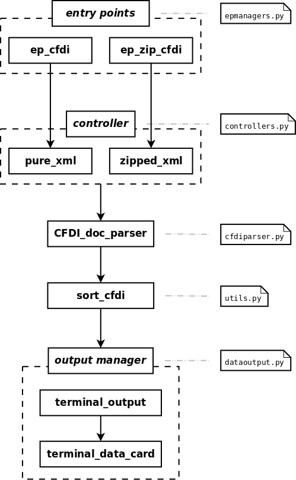

Documentación
=============

La secuencia de procesamiento utilizada por **CFDI Scraper** se muestra en el siguiente diagrama:

La documentación de cada una de las funciones involucradas se muestra a continuación:

Controllers
-----------

.. currentmodule:: cfdiscraper.controllers

· prue_xml
~~~~~~~~~~

.. autofunction:: pure_xml

· zipped_xml
~~~~~~~~~~~~

.. autofunction:: zipped_xml

Core functions
--------------

· CFDI_doc_parser
~~~~~~~~~~~~~~~~~

.. currentmodule:: cfdiscraper.cfdiparser

.. autofunction:: cfdi_doc_parser

· sort_cfdi
~~~~~~~~~~~

.. currentmodule:: cfdiscraper.utils

.. autofunction:: sort_cfdi

Output managers
---------------

.. currentmodule:: cfdiscraper.dataoutput

· terminal_output
~~~~~~~~~~~~~~~~~

.. autofunction:: terminal_output

· terminal_data_card
~~~~~~~~~~~~~~~~~~~~

.. autofunction:: terminal_data_card
