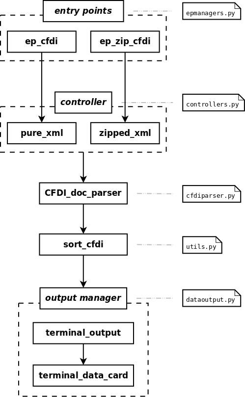

.. CFDIScraper documentation master file, created by
   sphinx-quickstart on Sun Nov 15 21:28:28 2015.
   You can adapt this file completely to your liking, but it should at least
   contain the root `toctree` directive.

Welcome to CFDIScraper's documentation!
=======================================

**CFDI Scraper** es una utilidad en linea de comando enfocada al procesamiento de conjuntos de archivos CFDI en formato XML, comprimidos en zip, para la extracción de sus :ref:`datos_de_interes`:

* Número total de XML por procesar
* Tipo de comprobante: ingreso / egreso
* Fecha
* Serie y folio
* Emisor (De): razón social, RFC, nombre comercial
* Receptor (Para): razón social, RFC, nombre comercial
* SubTotal
* IVA
* IEPS
* Total

La secuencia de procesamiento utilizada por **CFDI Scraper** se muestra en el siguiente diagrama:

.. Contents:

.. toctree::
   :maxdepth: 2
   :hidden:
   
   documentacion/documentacion
   datosinteres
   infosalida
   POIs

.. Indices and tables
.. ==================

.. * :ref:`genindex`
.. * :ref:`modindex`
.. * :ref:`search`

