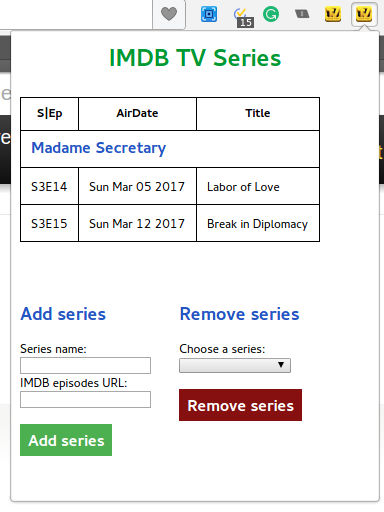

# IMDB Series extension

Chrome/Opera extension that manages (TV series name, IMDB episodes guide URL) pairs to create an episode's airdate resume from 21 days before the actual date to 7 days in the future.

## Quick references
https://developer.chrome.com/extensions/xhr
https://developer.chrome.com/extensions/storage
http://stackoverflow.com/questions/41042622/saving-data-from-a-chrome-extension
